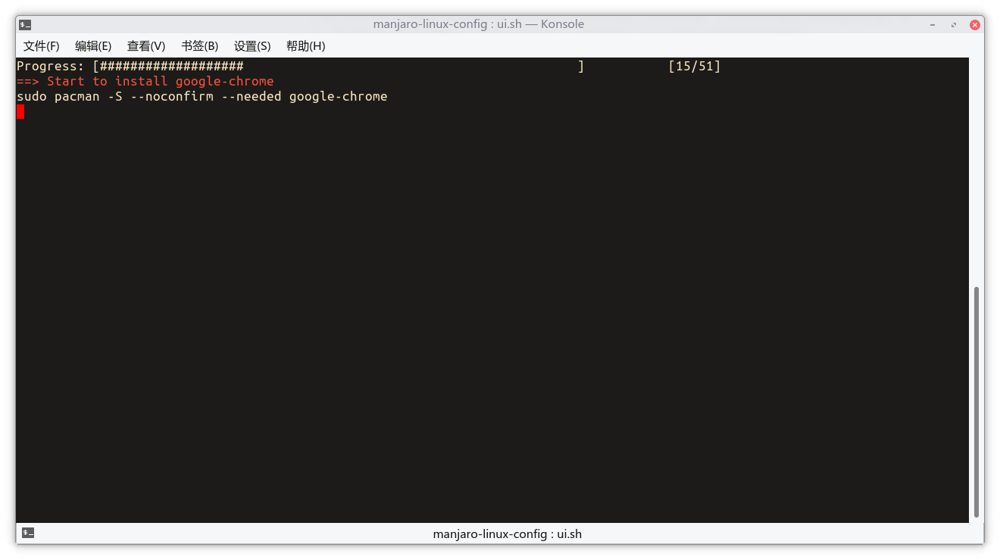

## manjaro linux configuration

用于快速配置manjaro linux（常用软件，vim，zsh，pacman\、terminator、i3wm）

### Install

```shell
 sh -c "$(curl -fsSL https://raw.github.com/dongchangzhang/manjaro-linux-config/master/setup.sh)"
```


### 功能特性

1. 应用程序安装

   * pacman使用--noconfirm、--needed参数，会跳过已经安装过的app，并且不会对软件是否进行安装进行确认，因此只需在程序运行开始输入sudo密码，需要注意在运行前需查看res/app/pacman和res/app/yaourt确认文件中列出的app是否是你需要的以及是否需要添加或者删除，其中pacman文件中的app使用pacman命令安装，yaourt中的使用yaourt进行安装，每个软件一行。

   * app安装过程中有进度条显示，对出错app对使用notify-send发出通知，安装结束后会显示统计信息，运行目录下会产生install.log记录安装日志

     

2. zsh

   * 命令高亮

   * 双击Esc为当前指令前添加sudo

   * 命令补全、提示等

   * 替换了普通模式下的rm指令，防止文件被错误删除，但是sudo状态下的rm暂时没有解决，具体如下：

     rm -rf  文件们 =》 将文件移动到home目录下的.delete目录中的以当前时间命名的文件夹中，并且在~/.delete中生成delete.log记录文件的删除日志。

     unrm  =》 撤销上一次删除，必须在同一终端下执行，并且写入日志

     lastrmtowhere =》查看上一次删除的文件的目前位置

     cleandel  =》清空.delete文件夹内容

3. vim

   * leader按键为 ","

   * 使用airline，可以自定义是否使用powerline字体

   * vundle管理插件

   * 常用快捷键：

     Space(就是空格）等价于 :

     leader w  等价于 :w!

     leader q  等价于 :q

     leader q1 等价于 :q!

     leader wq / WQ等价于:wq

     leader y 等价于 “+y（向系统剪贴板复制）

     leader p 等价于 ”+p （从系统剪贴板粘贴）

     Ctrl l（ctrl加l，在进行搜索后清除高亮）

     leader Tab（在多个已经打开的文件中进行切换）

     leader tb 打开tagbar

     leader nt打开nerdtree

     leader cc对选中的进行快速注释

     leader cu对选中的取消注释

     leader jd调到定义处

     F5重新进行语法检查

     F9运行当前的c，java，sh代码

4. pacman

   * 使用中科大的archlinuxcn源
   * 使用了gericom源用以下载papirus图标和arch-kde主题（后者用于kde桌面，不使用kde可以到res/app/pacman中将其 删除）
   * 高亮显示

5. kde shortcut

   对于kde用户，可以进入设置中的快捷键设置载入我的快捷键设置，主要有一下几点更改：

   * Win + E 打开dolphin
   * Ctrl + Alt + T 打开konsole
   * Win + D 返回桌面
   * Win + W 平铺当前所有桌面的窗口
   * Win + S 平铺显示所有桌面
   * Win + 1/2/3/4 进入第1/2/3/4个桌面
   * Win + Space或Alt + Space打开搜索

### 小工具

1. 程序列表整理、去重

   执行res/app/sort-pacman-yaourt.sh

2. home目录备份

   使用pigz多线程打包，运行backup.sh -q查看


